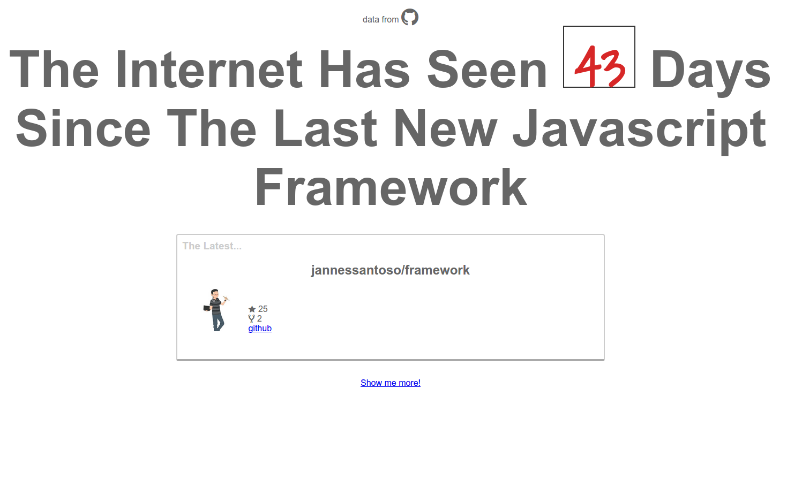

title: The Elm Report
author:
  name: Noah
  url: https://github.com/eeue56
output: basic.html
style: style.css
override: true
controls: true

--

<script src="elm/basic/elm.js"></script>

# The Elm Report
## The state of Elm in the modern web development world


--

### Web development as of 2015

Web development is a weird thing. Out of most modern platforms, it reaches to the largest consumer base, along with the largest developer base. As a result, you have many different approaches to doing the same thing. 


There is little agreement across these different developer groups on the technology stack to use


--


--

### So what's this all about?


This paper is going to look at a small section of the web development world.

In particular, we are going to look at Elm and how some of the concepts in Elm aim to solve some of the issues with modern Javascript.


--

### What do I need to know already?

Nothing. This talk assumes nothing about what you already know. 

Every concept that's important will be explained from the ground up, with examples of uses and explanations of why and how.
--

# Intro to Elm

--

### Elm is..

 * designed around FRP
 * inspired heavily by Haskell
 * HTML implementation inspired by React

--

### Who does Elm appeal to?

Elm appeals to three main markets: 
 * Those who use Haskell
 * Those who use React
 * Those who enjoy learning languages

Elm provides a framework similar to React's Flux, in a language similar to Haskell.

--

# Functional Reactive Programming (FRP)

## A new way to write interactive code

--

### What exactly is FRP?

Functional reactive programming (FRP) is a way of modelling values that change over time. 

Rather than representing changes by manually updating some variable to store the value, instead FRP works on the principle of using functional-style maps, folds and filters to express code that can be deemed reactive to some value

--

### FRP example


The current time is a perfect example of FRP.
In a non-reactive language, you can model changes in time through a couple of different ways -

```python
    while True:
        current_time = datetime.now()
        update_view(current_time)
        time.sleep(1000)
``` 

```javascript
    setInterval(function({
        currentTime = (new Date()).getHours();
        updateView(currentTime);
    }), 1000);
```

whereas in an FRP based language, you would instead do -

```haskell
    Signal.map timeView (every second)
```


--

### What's the difference?

In our Python and Javascript examples, our program relies on us updating a mutable value (currentTime) in order to be used elsewhere in the program. 

The developer must be sure to write update functions that not only update the variables used, but the view too.

In our Elm example, there's no need to worry about updating our variables manually. Signal.map will send our view function the time whenever a new signal is produced with a new time (in this case, every second)


--

### Why are people excited about FRP?

FRP provides a way of modelling programs without the need for callback hell, simplifying the code base. 

Instead of worrying about how to update variables, instead the developer can write code focusing on how the variable should be used.

In a developement world where the code bases are prone to getting complex and unstructured, simiplifying things is important.

--

### Javascript solutions

Solutions such as [`RxJs`](https://github.com/Reactive-Extensions/RxJS) already exist and are used in the wild. `Rx` itself is based largely off of a standard which is language-agnostic, meaning that solutions exist in multiple languages.

It is the most widely used library outside of Haskell's FRP implementations.

The lack of FRP-support built-in means that code for expressing models can be complicated quickly a we'll look at in the next couple of slides.


--

### Back to Elm

An example with RxJS:

```javascript
var source = getAsyncStockData();

var subscription = source
  .filter(function (quote) {
    return quote.price > 30;
  })
  .map(function (quote) {
    return quote.price;
  })
  .subscribe(
    function (price) {
      console.log('Prices higher than $30: $' + price);
    },
    function (err) {
      console.log('Something went wrong: ' + err.message);
    });
subscription.dispose();

```
The previous example in Elm looks like this

```haskell
moreThan30 = List.filter (\quote -> quote.price > 30)
logItem v = log "Prices higher than $30: $"
Signal.map (moreThan30 >> List.map logItem) getAsyncStockData

```

--

### It's neater, right?

Having a language designed around Elm, with inspiration from Haskell, means you end up with things like this -

```haskell
Signal.map : (a -> b) -> Signal a -> Signal b
```

`Signal.map` applies functions to data contained within a `Signal`.


--

### The use of functors

Elm enables the developer to write their functions ignoring how signals work internally. 

This enables them to express a program at higher level of abstraction, simplifying both the writing and reading of code.

Elm therefore is very exciting to developers.

--

### Sounds great, what's wrong with it?

My paper aims to:
 * compare Elm to existing frameworks for simplifying web-based applications
 * examine the structure of an Elm application
 * examine why Elm has yet to see wide adoption
 * highlight potential steps for increasing production adoption

--

# Structure of Elm apps

--

### The Elm Architecture

Elm has a defined architecture that all Elm apps follow:

##### Model

Stores the data in your application

##### View

Generates a visualization of your data in the model

##### Update

Updates your model based off the current input Signal

--

### What does this look like?

```haskell
import Html exposing (div, button, text)
import Html.Events exposing (onClick)

type Action = Increment | Decrement | None
type alias Model = Int

model : Model
model = 0

currentClick : Signal.Mailbox Action
currentClick = Signal.mailbox None

update : Action -> Model -> Model
update action model =
    case action of
        Increment -> model + 1
        Decrement -> model - 1
        None -> model

view : Signal.Address Action -> Model -> Html.Html
view address model = 
    div []
        [ button [ onClick address Increment ] [ text "+" ]
        , div [] [ text (toString model) ]
        , button [ onClick address Decrement ] [ text "-" ] 
        ]

model' : Signal.Signal Model
model' = Signal.foldp update model currentClick.signal

main = Signal.map (view currentClick.address) model'
```

makes: 
<div id="example"></div>
<script> var div = document.getElementById('example'); Elm.embed(Elm.BasicExample, div);</script>

--

### How it works

Elm follows what we call an model-view-update (MVU) cycle. 

Each change in a mapped signal makes the update cycle happen. 

#### Update cycle
 * on signal change, map update function with signal value and model
 * store changes made to model in model
 * pass updated model to view function

--

### Even more how it works

Each `update` function has a type signature along the lines of

```haskell
update : Action -> Model -> Model
```

`Actions` are a way of representing the things that happen in your application at a high level.

For example, in our previous example we only had three `Actions`

```haskell
type Action = Increment | Decrement | None
``` 

_By looking at the definition of an Action, we can tell what our application can do_

--

### Action example

Let's look at someone else's source code.
```haskell
type Command =
  Nop |
  MoveBy Grid.Position |
  MoveTo Leaf |
  Continue |
  RestartLevel |
  Start (Maybe Game)
```

`Command` here is our `Action` type. It has seven possible interactions. Just seven, abstract forms of interaction. 

Everything we can do which will change the model of the application falls into one of these types.


taken from [Froggy example](https://github.com/thSoft/froggy/blob/master/src/elm/Froggy/Commands.elm)

-- 

### vs React

Compare this is a render function taken from _one_ component in React -

```javascript
 render: function() {
    return (
      <div>
        <h1>Top ten companies with Attendees</h1>
        <TopTen ten={this.state.top}></TopTen>
        <div className="Chart" ></div>
        <h1>Proportion of Attendees grouped by number of events</h1>
        <RadioButtons init_value={this.state.value} onChange={this.onValueChanged}/>
        <h2>Select Time Range</h2>
        <Demo orientation='horizontal' defaultValue= {[0,1747]} max = {1747} changeHandler={this.onSliderChanged} />
        <p>Start Date:{this.state.dates[0]}</p>
        <p>End Date:{this.state.dates[1]}</p>
        <p>N of {this.state.value=='company' ? 'Companies' : 'Individuals' } attending in this timeframe:</p>
      </div>
    );
```

Can you tell how many types of interaction there are? Can you tell what they do?

--

# Let's talk about Signals

--

### Signals

Signals are the implementation of FRP that Elm uses. 

Signals have 3 important methods:

```haskell
map :: (a -> b) -> Signal a -> Signal b
foldp :: (a -> b -> b) -> b -> Signal a -> Signal b
filter :: (a -> Bool) -> a -> Signal a -> Signal a
```

 * `map` applies a function to a value within a signal, producing a new signal
 * `foldp` applies a fold function to a value, given a start value, and produces new signals based on the old one
 * `filter` filter applies a function that converts a value into `True/False`, keeping the signals that pass and discarding the rest 

--

### I'm confused already

Scared? Don't worry, it's not as confusing as it seems. For most uses, you'll only need to worry about using `Signal.map`. 

In layman's terms, `Signal.map` allows us to apply a function to a value contained within a `Signal` and create a different resulting Signal.

```haskell
name : Signal String
name = <incoming name>

uppercaseName : Signal String
uppercaseName = Signal.map (toUpper) name
```


--

# Callbacks in Elm

-- 

### Event listeners in Elm


Elm uses the concept of mailboxes to capture event listeners.

Mailboxes:
 * Provide an address for sending items to
 * Store messages of a given type (e.g `Action`)
 * Produce a signal that updates for each item in the message box

--

### Our example

This is a slightly different way of implementing our previous example. It does the exact same thing, and functions in the exact same way.

```haskell
import Html exposing (div, button, text)
import Html.Events exposing (onClick)

type Action = Increment | Decrement | Noop

model = 0
model' = Signal.foldp update model actions.signal

main = Signal.map (view actions.address) model'

view : Signal.Address Action -> Int -> Html.Html
view address model =
  div []
    [ button [ onClick address Decrement ] [ text "-" ]
    , div [] [ text (toString model) ]
    , button [ onClick address Increment ] [ text "+" ]
   ]
   
actions: Signal.Mailbox Action
actions = Signal.mailbox Noop

update action model =
  case action of
    Increment -> model + 1
    Decrement -> model - 1
    Noop -> model
```

--


### What does this look like?

Let's explicitly look at mailboxes from our previous example.

We create a mailbox with a default message to start with

```haskell
actions : Signal.Mailbox Action
actions = Signal.mailbox Noop
```

Once we have a mailbox, we can grab the two important fields in the Mailbox record

```haskell
type alias Mailbox a = 
    { address : Address a
    , signal : Signal a 
    }
```

--

### How do we use these fields?

```haskell
model' = Signal.foldp update model actions.signal
```

`actions.signal` will give us access to the signal produced by the mailbox. This signal is updated any time something is sent to the associated mailbox

```haskell
main = Signal.map (view actions.address) model'
```

`actions.address` will give us the address for the mailbox, which we can use to send items to the mailbox as below

```haskell
view : Signal.Address Action -> Int -> Html.Html
view address model =
  div []
    [ button [ onClick address Decrement ] [ text "-" ]
    , div [] [ text (toString model) ]
    , button [ onClick address Increment ] [ text "+" ]
   ]
```


--

### vs traditional Javascript

There are no `x.addEventListeners` in Elm. <sup>not actually true</sup> If you want to know what happens, look at the `Action` and `update` function. The developer no longer needs to look everywhere in case some other developer decided to introduce mutations in a different place to everyone else.

This is one of the biggest strengths of Elm. The use of immutability, along with a foldp-structure, makes expressing applications simple.


--

### Type system

Elm is a static, strongly typed language, very similar to Haskell. If types don't match at compile-time, the developer will get an error.

```haskell

The right argument of (+) is causing a type mismatch.

3| f = d + "hello"
As I infer the type of values flowing through your program, I see a conflict
between these two types:

    number

    String

```

--

### Abstract Data Types

Abstract data types are the thing that makes the `type Action = Something | Nothing` possible. 

Being able to define your own ADTs has been something Haskell developers have enjoyed for a while - managing flow through an abstract representation of the data is preferable to using primative values.

--

### Real world ADTs

The following example is from [Stalk](https://github.com/eeue56/stalk/), a language with a built-in IDE written in Elm

```haskell
update : Action -> Program -> Program
update action program = 
  case action of 
    UpdateText x -> { program | enteredText <- x, steps <- 0 } 
    Enter -> { program | model <- programRunner program.enteredText program.model }
    Reset -> { program | model <- runCommand 0 (Clear, 0) program.model, steps <- 0 }
    Step ->
      case String.split "\n" program.enteredText of
        [] -> program
        x::xs ->
          let 
            program' = { program | model <- programRunner x program.model }
          in 
            { program' | enteredText <- String.join "\n" xs, steps <- program'.steps + 1 }
    Noop -> program
```

The use of `case..of` here is called _pattern matching_. Pattern matching in languages with ADTs means control flow by doing different things depending on the constructor used for a particular type.

--

### So what?

ADTs used in this manner control the features of your application. 

If someone wants to make a new feature, then they must add a new constructor for your `Action` type

--

### What are the current alternatives?

Picking alternatives in the web development community is never an easy thing. 

There is a common joke of "x days since a new Javascript framework has been released". 

There's even a website [dedicated](http://www.isaacchansky.me/days-since-last-new-js-framework/) to it.

--

## js framework jokes

</img>


--

### Javascript alternatives


There are many Javascript frameworks out there. For this project, we will look at Angular.js and React.js

#### Angular
 * Uses dirty checking for updating variables
 * Many different ways of doing things - services, 

#### React/Flux

 * Virtual DOM for rendering speed
 * DSL (JSX) for writing HTML contained within Javascript objects
 * Limit scope of each "component" of your page

--

### Redux 

Redux takes the Elm architecture and attempts to apply it to Javascript.

The structure of a Redux app is far more fragmented than an Elm application, and is more difficult to get into.

-- 

### Haskell alternatives

There's also many "compile to Javascript" languages out there. We'll be looking at Haskell-based alternatives such as Fay and GHC.js.

#### Fay

 * Haskell subset
 * FFI for running Javascript code
 * FFI has Haskell type support

#### GHC.js

  * Haskell subset
  * Predefined functions that can be used in lots of different ways
  * Predefined functions prefered to using raw FFI

